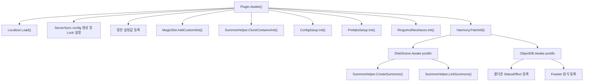

# MagicPlugin.dll 코드 분석 보고서

분석 대상: `C:/Users/blizz/AppData/Roaming/com.kesomannen.gale/valheim/profiles/zxcv/BepInEx/plugins/blacks7ar-MagicPlugin/MagicPlugin.dll`

분석일: 2026-05-06

도구: `ilspycmd 9.1.0.7988`로 C# 디컴파일 후 구조 분석

주의: 이 문서는 DLL에서 복원한 코드를 원문 그대로 재배포하지 않고, 클래스 구조와 동작을 요약한 분석 문서다. 디컴파일 특성상 일부 속성 인자나 Unity 타입 표기는 원본 소스와 다르게 보일 수 있다.

## 1. 한눈에 보는 결론

`MagicPlugin`은 Valheim용 BepInEx 플러그인이다. 핵심 기능은 다음 네 축으로 구성된다.

| 축 | 역할 |
| --- | --- |
| 아이템/프리팹 등록 | `magicbundle` AssetBundle에서 무기, 방어구, 음식, 토템, 이펙트 프리팹을 등록한다. |
| 설정/서버 동기화 | ServerSync 기반으로 대부분의 수치 설정을 서버 기준으로 동기화한다. |
| 상태효과/스탯 바인딩 | 장비 착용 효과, Eitr 보너스, Eitr 재생, 냉기 면역, 힐 오버타임, 스킬 보너스를 연결한다. |
| Harmony 패치 | 공격, 소환, 스킬 경험치, 장비 슬롯, 탑승 소환수, 채광/벌목 판정 등 Valheim 런타임 동작을 후킹한다. |

구조적으로는 `Plugin.Awake()`가 전체 초기화의 중심이고, `PrefabsSetup`, `ConfigSetup`, `StatsSetup`, `SummonHelper`, `Patches` 네임스페이스가 실제 모드 기능을 만든다. DLL에는 모드 자체 코드 외에도 `ItemManager`, `ServerSync`, `LocalizationManager`, `YamlDotNet`, optional API shim 등이 ILRepack 형태로 함께 들어 있다.

## 2. 어셈블리 메타데이터

| 항목 | 값 |
| --- | --- |
| BepInEx GUID | `blacks7ar.MagicPlugin` |
| 이름 | `MagicPlugin` |
| 버전 | `2.1.9` |
| 파일 크기 | 약 26.5 MB |
| 대상 프레임워크 | `netstandard2.1` |
| 빌드 정보 | `Release`, `AssemblyVersion 2.1.9.0`, `AssemblyFileVersion 2.1.9` |
| 포함 리소스 | `MagicPlugin.assets.magicbundle`, `MagicPlugin.translations.English.yml`, `ILRepack.List` |
| Soft dependency로 보이는 항목 | `Azumatt.AzuExtendedPlayerInventory`, `org.bepinex.plugins.jewelcrafting` |

`manifest.json` 기준 설명은 “초반부터 엔드게임까지의 마법 무기, 소환 토템, 방어구 세트, 액세서리 전용 슬롯, Eitr 음식, 전투 탈것을 추가”하는 모드다. 변경 로그의 최신 항목은 `v2.1.9`, Valheim build `221.10` 대응이다.

## 3. 디컴파일된 코드 규모

| 네임스페이스/묶음 | 파일 수 | 대략 라인 수 | 성격 |
| --- | ---: | ---: | --- |
| `MagicPlugin` | 39 | 5,862 | 모드 자체 기능 |
| `ItemManager` | 20 | 2,927 | 아이템/레시피/프리팹 등록 유틸 |
| `ServerSync` | 7 | 1,530 | 설정 서버 동기화 |
| `LocalizationManager` | 2 | 247 | 번역 로딩 |
| `YamlDotNet` | 220 | 12,522 | YAML 파서 라이브러리 |
| `Jewelcrafting` | 9 | 257 | Jewelcrafting API shim |
| `AzuExtendedPlayerInventory` | 2 | 47 | AzuEPI API shim |
| 기타 `System`/`Properties` | 13 | 118 | 컴파일러/호환성 보조 |

모드 자체 로직은 `MagicPlugin` 네임스페이스 39개 파일에 집중되어 있다. `YamlDotNet`은 번역 YAML 처리용 외부 라이브러리라 모드 설계 로직은 거의 없다.

## 4. 전체 초기화 흐름

`Plugin.Awake()`는 `Config.SaveOnConfigSet`을 잠시 꺼서 대량 설정 생성 중 파일 저장을 늦춘 뒤, 끝에서 저장을 켠다. 이 흐름은 초기 설정 파일 생성 비용을 줄이려는 의도다.

## 5. 핵심 파일별 책임

| 파일 | 역할 |
| --- | --- |
| `Plugin.cs` | BepInEx 진입점, 일반 설정, ServerSync, Harmony 패치, 소환 해제 단축키, Asksvin 탑승 공격 처리 |
| `Functions/ConfigSetup.cs` | 장비/무기/소환수/음식/쿨다운 관련 설정값 생성 |
| `Functions/PrefabsSetup.cs` | AssetBundle 로딩, 아이템 생성, 레시피 지정, 프리팹 등록, 장비 효과 연결 |
| `Functions/StatsSetup.cs` | 설정값을 장비의 Eitr 재생/마법 소모량/공격 소모량에 실시간 반영 |
| `Functions/SummonHelper.cs` | 바닐라 몬스터 프리팹 복제, 아군 소환수화, 토템 SpawnAbility 연결 |
| `Functions/MagicSlot.cs` | Azu Extended Player Inventory 연동용 Tome/Earring 전용 슬롯 로직 |
| `Functions/ShaderReplacer.cs` | AssetBundle 머티리얼 셰이더를 런타임 Unity 셰이더로 교체 |
| `JCAdditions/RingsAndNecklaces.cs` | Jewelcrafting이 있을 때 링/목걸이 추가 |
| `SE/*.cs` | 커스텀 StatusEffect 구현 |
| `Patches/*.cs` | Valheim 핵심 클래스 Harmony 패치 |

## 6. 설정 시스템

설정 등록은 `Plugin.config<T>()`로 래핑되어 있고, 모든 동기화 대상 설정은 `ConfigSync.AddConfigEntry()`에 등록된다. 설명문 끝에 `[Synced with Server]` 또는 `[Not Synced with Server]`가 붙는다.

주요 전역 설정:

| 그룹 | 설정 | 기본값 | 의미 |
| --- | --- | ---: | --- |
| `1- ServerSync` | `Lock Configuration` | `On` | 서버 관리자만 설정 변경 가능 |
| `2- General` | `Velocity Multiplier` | `2` | 마법 투사체 속도 배율 |
| `2- General` | `Accuracy Multiplier` | `0` | 마법 투사체 정확도 배율 |
| `2- General` | `Enable Tome Slot` | `On` | AzuEPI 전용 Tome 슬롯 |
| `2- General` | `Enable Earring Slot` | `On` | AzuEPI 전용 Earring 슬롯 |
| `2- General` | `Enable Slow Fall` | `On` | 망토의 slow fall 효과 |
| `2- General` | `Unsummon Key` | `LeftShift + F` | 소환수 해제 단축키, 클라이언트 로컬 |
| `4- Skill Exp` | `Enable Exp Multiplier` | `On` | 마법 스킬 경험치 배율 사용 |
| `4- Skill Exp` | `Display Exp Gained` | `On` | 마법 스킬 경험치 메시지 |
| `4- Skill Exp` | `BloodMagic Exp Multiplier` | `1` | Blood Magic 경험치 배율 |
| `4- Skill Exp` | `ElementalMagic Exp Multiplier` | `1` | Elemental Magic 경험치 배율 |

장비 세트 Eitr 기본값:

| 세트 | 부위별 Eitr | Eitr Regen |
| --- | --- | --- |
| Rootweave | 망토/투구 `10`, 갑옷/바지 `12` | `0.07` |
| Shadowleaf Vanguard | 망토/바지 `14`, 모자/튜닉 `16` | `0.12` |
| Arcane Weavers Mantle | 망토/바지 `22`, 후드/조끼 `24` | `0.22` |
| Frostfang Vanguard | 망토/후드 `18`, 갑옷/바지 `20` | `0.17` |
| Scarab | 망토/모자 `26`, 갑옷/바지 `28` | `0.27` |
| Inferno Emberweave | 망토/후드 `30`, 갑옷/바지 `32` | `0.32` |

주요 특수 장비 설정:

| 장비 | 기본 설정 |
| --- | --- |
| Wizards Belt | Eitr `72` |
| Eitr Earring | Eitr `48` |
| Beginners Magic Book | Eitr `24` |
| Advance Magic Book | Eitr `48` |
| Druids Tome | Eitr `62` |
| Dvergrs Belt | Eitr Regen `1` |
| Elementalist Belt | ElementalMagic `+30` |
| Necromancers Belt | BloodMagic `+30` |
| Hogwarts Belt | 원소 피해 배율 `3` |
| Flame/Ice/Lightning Scepter | 기본 Magic Source `Eitr`, 주공격 소모 `35`, 보조공격 소모 `80` |

소환/공격 기본 설정:

| 대상 | 기본값 |
| --- | --- |
| 대부분의 토템 쿨다운 | `60s` |
| Wolf Totem 요구 BloodMagic | `20` |
| Drake Totem 요구 BloodMagic | `15` |
| Moders/Yagluths Heritage 쿨다운 | `15s` |
| Moders/Yagluths Heritage Eitr 소모 | `100` |
| Moders/Yagluths Heritage Stamina 소모 | `30` |
| 스태프 AOE 기본 반경 | `3`, ElementalMagic 스킬팩터로 추가 증가 |
| Staff of Healing | 힐량 `50`, 쿨다운 `10s`, 지속 `10s`, 틱 간격 `0.5s` |

소환수 체력 기본값:

| 소환수 | 기본 체력 |
| --- | ---: |
| Neck | 160 |
| Fenring Cultist | 350 |
| Armored Skeleton | 500 |
| Toxic/Fiery/Frosty/Lightning Slime | 200 |
| Asksvin | 900 |
| Charred Melee | 700 |
| Charred Range | 350 |
| Drake | 250 |
| Seeker Brute | 1600 |
| Valkyrie | 1600 |
| Bjorn | 900 |
| Vile | 1300 |

## 7. 아이템/프리팹 등록 구조

`PrefabsSetup.Init()`은 `PrefabManager.RegisterAssetBundle("magicbundle")`로 임베디드 AssetBundle을 로드한 뒤, 아이콘, 아이템, 소환수 프리팹, 이펙트를 순차 등록한다.

아이템 생성 패턴은 대체로 다음과 같다.

1. `new Item(_magicBundle, "PrefabName")`으로 AssetBundle 프리팹을 ItemManager에 등록한다.
2. `item.Crafting.Add(...)`로 제작대를 지정한다.
3. `RequiredItems`와 `RequiredUpgradeItems`로 제작/강화 재료를 지정한다.
4. `Configurable = Recipe | Stats` 또는 `Recipe`로 ItemManager 설정 생성 범위를 정한다.
5. 필요 시 `ShaderReplacer.Replace(item.Prefab)`로 머티리얼 셰이더 교체 대기열에 넣는다.
6. 투사체/이펙트/소환 SpawnAbility는 `PrefabManager.RegisterPrefab()`으로 ZNetScene 전용 프리팹에 등록한다.
7. 장비 착용 효과가 필요한 경우 `ScriptableObject.CreateInstance<StatusEffect>()`로 생성해서 `m_equipStatusEffect`에 연결한다.

### 주요 아이템 매트릭스

| 그룹 | 아이템/프리팹 | 제작대 | 핵심 재료/특징 |
| --- | --- | --- | --- |
| 입문 무기 | `BMP_BeginnerStaff` | Workbench | BoneFragments, Resin, Wood |
| 팔 무기 | `BMP_BlazeArm`, `BMP_FrostArm`, `BMP_VenomArm` | MageTable | Ashlands 재료 기반, 각각 전용 projectile 등록 |
| 초중반 스태프 | `BMP_SurtlingStaff`, `BMP_EikthyrsStaff`, `BMP_LightningStaff`, `BMP_ArcticStaff`, `BMP_PoisonStaff`, `BMP_HealStaff` | Workbench/Forge | 원소 투사체, AOE, Staff of Healing은 `HealGroup` 연결 |
| 성장형 완드 | `BMP_FlameWand`, `BMP_IceWand`, `BMP_LightningWand`, `BMP_PoisonWand` | Workbench | 기본 제작은 초반 재료, 업그레이드에서 biomes progression 반영 |
| 엔드게임 셉터 | `BMP_FlameScepter`, `BMP_IceScepter`, `BMP_LightningScepter` | MageTable | Magic Source를 Stamina/Eitr/Both 중 선택 가능 |
| 헤리티지 무기 | `BMP_ModersInheritence`, `BMP_YagluthsInheritence` | Forge | 보스 트로피 기반, 대형 광역 투사체/쿨다운 |
| 토템 | Neck, Wolf, Crystal, Skull, Asksvin, Charred, Drake, Seeker, Valkyrie, Bjorn, Vile | Workbench/Forge/MageTable | `SpawnAbility` 프리팹이 아군 소환수 프리팹으로 연결됨 |
| 방어구 | 6세트 24부위 | Workbench | 각 부위에 Eitr/Eitr regen 설정 연결, 일부 망토는 slow fall |
| 벨트 | Dvergr, Wizards, Elementalist, Hogwarts, Haldors, Necromancers | Workbench/ArtisanTable | Eitr, Eitr regen, 스킬 보너스, 원소 피해 배율 |
| 귀걸이 | Dvergr, Eitr, Fire/Frost/Poison Resist | Forge | Eitr 또는 저항 StatusEffect |
| 음식 | MountainSoup, MountainStew, MushroomJam, MushroomPie, SautedMeatMushroom, MushroomPuff | Cauldron/Inventory | Eitr 음식, Feaster piece table에도 등록 |

`Effects()`는 65개의 사운드/VFX/카메라 셰이크 프리팹을 ZNetScene 전용으로 등록한다. 이는 투사체나 소환 연출에서 참조하는 프리팹 누락을 막기 위한 방어적 등록이다.

## 8. 방어구와 장비 효과

방어구 24개는 모두 `Armors()`에서 생성된다. 착용 효과는 두 층으로 나뉜다.

| 층 | 구현 |
| --- | --- |
| Eitr 최대치 증가 | `AddEitr` 또는 `SlowFallAndEitr` StatusEffect가 이름 해시로 감지되고, `Player.GetTotalFoodValue` postfix가 `eitr`에 값을 더한다. |
| Eitr regen 증가 | `StatsSetup`이 `item.m_shared.m_eitrRegenModifier`를 설정하고 설정 변경 이벤트에 바인딩한다. |

망토 중 일부는 `SlowFallAndEitr`를 사용한다. 이 효과는 `ModifyWalkVelocity()`에서 하강 속도를 제한하고, `ModifyFallDamage()`에서 낙하 피해를 줄인다. `Enable Slow Fall`이 꺼져 있으면 tooltip과 실제 slow fall/fall damage 보정이 비활성화되고 Eitr 보너스만 남는다.

## 9. StatusEffect 클래스 분석

| 클래스 | 역할 |
| --- | --- |
| `AddEitr` | 착용자의 Eitr 증가 tooltip을 제공한다. 실제 Eitr 증가는 `PlayerPatch.GetTotalFoodValue_Postfix`에서 처리된다. |
| `SlowFallAndEitr` | Eitr tooltip + 낙하 속도 제한 + 낙하 피해 무효화/감소. |
| `HealGroup` | 일정 시간 동안 주기적으로 체력을 회복한다. Staff of Healing의 공격 StatusEffect로 사용된다. |
| `Elementalist` | ElementalMagic 스킬 레벨 보너스를 표시한다. 실제 스킬 증가는 `SkillsPatch.GetSkillLevel_Postfix`. |
| `Necromancer` | BloodMagic 스킬 레벨 보너스를 표시한다. 실제 스킬 증가는 `SkillsPatch.GetSkillLevel_Postfix`. |
| `Hogwarts` | 원소 피해 배율 tooltip. 실제 배율은 `ItemDataPatch.GetDamage_Postfix`. |
| `ForestMagic` | Eitr regen을 퍼센트 방식으로 수정하는 세트 효과용 StatusEffect. |
| `ArcticBuff` | Eitr regen 증가 + Cold/Freezing 방지. 실제 냉기 차단은 `PlayerPatch`와 `SEManPatch`가 함께 수행한다. |

## 10. 소환 시스템

`SummonHelper`는 Valheim의 기존 몬스터 프리팹을 복제해 `BMP_*Friendly` 소환수로 만든다.

복제 대상:

| 원본 프리팹 | 새 프리팹 | 표시 이름 |
| --- | --- | --- |
| `Neck` | `BMP_NeckFriendly` | `$bmp_neck_summon` |
| `Fenring_Cultist` | `BMP_CultistFriendly` | `$bmp_cultist_summon` |
| `Skeleton_Friendly` | `BMP_ArmoredSkellies` | `$bmp_armoredskellies` |
| `Asksvin` | `BMP_AsksvinFriendly` | `$bmp_asksvin_summon` |
| `Charred_Archer` | `BMP_CharredRangeFriendly` | `$bmp_charredrange_summon` |
| `Charred_Melee` | `BMP_CharredMeleeFriendly` | `$bmp_charredmelee_summon` |
| `Hatchling` | `BMP_HatchlingFriendly` | `$bmp_drake_summon` |
| `SeekerBrute` | `BMP_SeekerBruteFriendly` | `$bmp_seekerbrute_summon` |
| `FallenValkyrie` | `BMP_ValkyrieFriendly` | `$bmp_valkyrie_summon` |
| `Bjorn` | `BMP_BjornFriendly` | `$bmp_bjorn_summon` |
| `Unbjorn` | `BMP_VileFriendly` | `$bmp_vile_summon` |

복제 시 공통 처리:

| 처리 | 내용 |
| --- | --- |
| 이름/체력/세력 | `m_name`, `m_health`, `m_faction` 설정 |
| 드롭/번식 제거 | `CharacterDrop`, `Procreation` 컴포넌트 제거 |
| AI | `hearRange 9999`, `alertRange 20` |
| Tameable | 시작부터 tame, commandable false, owner logout 후 120초 unsummon |
| 스킬 성장 | `m_levelUpOwnerSkill = BloodMagic`, `m_levelUpFactor = 0.5` |
| 색/스케일 | 랜덤 스케일 및 색상 tint 적용 |

토템 SpawnAbility 연결:

| 토템 SpawnAbility 프리팹 | 연결되는 소환수 |
| --- | --- |
| `BMP_NeckTotem_Neck_Spawn` | Neck |
| `BMP_WolfTotem_Cultist_Spawn` | Fenring Cultist |
| `BMP_SkullTotem_Spawn` | Armored Skeleton |
| `BMP_AskvinTotem_Spawn` | Asksvin |
| `BMP_CharredTotem_Spawn` | Charred Melee + Charred Range |
| `BMP_DrakeTotem_Spawn` | Drake |
| `BMP_SeekerBruteTotem_Spawn` | Seeker Brute |
| `BMP_ValkyrieTotem_Spawn` | Valkyrie |
| `BMP_BjornTotem_Spawn` | Bjorn |
| `BMP_VileTotem_Spawn` | Vile |

`ArmoredSkeleton`은 별도 MonoBehaviour로, 생성 시 무작위 2H 무기와 철/은/패딩/카러페이스 계열 방어구를 선택해 시각 장비와 humanoid random set에 넣는다.

## 11. Harmony 패치 분석

### 공격/투사체

| 패치 | 대상 | 동작 |
| --- | --- | --- |
| `AttackPatch.AttackStart_Postfix` | `Attack.Start` | 특정 마법 무기의 damage multiplier를 `1 + ElementalMagic skillFactor`로 설정한다. Staff of Healing은 조건 충족 시 BloodMagic 경험치를 올린다. |
| `AttackPatch.FireProjectileBurst_Prefix` | `Attack.FireProjectileBurst` | 마법 투사체 속도/정확도를 설정하고, 스태프 AOE 및 Moders/Yagluths 광역 피해를 설정값과 ElementalMagic skillFactor로 보정한다. |

예외 처리도 있다. scepter, flamestaff, thunderstaff, `ammo_spells`, 특정 clusterbomb projectile은 전역 속도/정확도 배율 대상에서 빠진다. Arctic staff와 바닐라 ice shards는 속도 `1.2x`, 정확도 `0`으로 따로 처리된다.

### 소환/쿨다운

| 패치 | 대상 | 동작 |
| --- | --- | --- |
| `SpawnAbilityPatch.Spawn_Prefix` | `SpawnAbility.Spawn` | 토템/헤리티지 무기별 쿨다운 StatusEffect를 검사하고 부여한다. Wolf/Drake 토템은 BloodMagic 레벨 요구도 검사한다. |
| `ObjectDBPatch.Awake_Postfix` | `ObjectDB.Awake` | 각 토템/헤리티지 쿨다운 StatusEffect를 ObjectDB에 추가한다. |
| `TameablePatch` | `Tameable.Awake`, `GetHoverText` | Asksvin 소환수 saddle 활성화, 모든 `BMP_` 소환수 hover text에 unsummon 키 표시. |

쿨다운 StatusEffect는 `Helper.CreateCooldown()`으로 생성된다. 이름은 `necktotem_cooldown` 같은 내부 키이고, 표시 이름/아이콘은 해당 토템 로컬라이즈 키와 아이콘을 사용한다.

### 플레이어/스킬

| 패치 | 대상 | 동작 |
| --- | --- | --- |
| `PlayerPatch.GetTotalFoodValue_Postfix` | `Player.GetTotalFoodValue` | 장비/책/귀걸이/벨트 StatusEffect 보유 여부에 따라 Eitr 최대치를 더한다. |
| `PlayerPatch.GetEquipmentEitrRegenModifier_Postfix` | `Player.GetEquipmentEitrRegenModifier` | Tome/Earring/Jewelcrafting 장신구의 Eitr regen을 합산한다. |
| `PlayerPatch.UpdateEnvStatusEffects_Prefix` | `Player.UpdateEnvStatusEffects` | Arctic Buff가 있으면 Cold/Freezing을 제거한다. |
| `SEManPatch.InternalAddStatusEffect_Prefix` | `SEMan.Internal_AddStatusEffect` | Arctic Buff가 있을 때 Cold/Freezing 추가 자체를 차단한다. |
| `SkillsPatch.RaiseSkill` | `Skills.RaiseSkill` | ElementalMagic/BloodMagic 경험치 배율 적용 및 획득량 메시지 표시. |
| `SkillsPatch.GetSkillLevel_Postfix` | `Skills.GetSkillLevel` | Elementalist/Necromancer 벨트 착용 시 스킬 레벨 보너스를 더한다. |
| `ItemDataPatch.GetDamage_Postfix` | `ItemData.GetDamage` | Hogwarts Belt 착용 시 fire/frost/lightning/poison/spirit 피해를 스킬팩터 기반으로 증폭한다. |

### 장비 슬롯/AzuEPI 연동

| 패치 | 대상 | 동작 |
| --- | --- | --- |
| `PlayerPatch.Awake_Prefix` | `Player.Awake` | 플레이어 `VisEquipment`에 대한 `MagicSlot` 인스턴스를 만든다. |
| `VisEquipmentPatch` | `OnEnable`, `OnDisable`, `UpdateEquipmentVisuals` | Tome/Earring 시각 장착 상태를 ZDO와 armor attach로 동기화한다. |
| `HumanoidPatch.IsItemEquiped_Postfix` | `Humanoid.IsItemEquiped` | 전용 슬롯에 든 Tome/Earring도 장착으로 간주한다. |
| `HumanoidPatch.EquipItemTranspiler` | `Humanoid.EquipItem` | Tome/Earring이면 전용 슬롯에 장착하도록 IL 삽입. |
| `HumanoidPatch.UnequipItemTranspiler` | `Humanoid.UnequipItem` | 전용 슬롯 장비 해제 처리 삽입. |
| `HumanoidPatch.StatusEffectsTranspiler` | `Humanoid.UpdateEquipmentStatusEffects` | 전용 슬롯 장비의 equip status effect를 장비 상태효과 집합에 추가한다. |

`MagicSlot.IsTomeItem()`은 이름이 `$bmp_`로 시작하고 `_magicbook`으로 끝나거나 `tome`으로 끝나는 아이템을 Tome으로 본다. `IsEarringItem()`은 `$bmp_`로 시작하고 `_earring`으로 끝나는 아이템을 Earring으로 본다.

### 탑승 소환수

| 패치/로직 | 동작 |
| --- | --- |
| `Plugin.Update()` | 플레이어가 Asksvin summon에 탑승 중이면 primary/secondary/block 입력을 몬스터 기본 아이템 공격으로 변환한다. |
| `PlayerPatch.SetControls_Prefix` | 탑승 중 플레이어 공격 입력을 막고, jump는 탈것 점프로 넘긴다. |
| `SaddlePatch.ApplyControls_Prefix` | `_autoRun` 상태면 Asksvin summon이 달리도록 run 입력을 보정한다. |
| `SaddlePatch.GetHoverText_Postfix` | Asksvin summon의 탑승 hover text를 재구성한다. |

Asksvin 공격은 세 종류다. primary는 stamina 8, secondary는 16, block 공격은 20을 사용하며, riding skill이 높을수록 `Mathf.Lerp(1, 0.5, riderSkill)`로 소모량이 줄어든다.

### 채광/벌목 판정

| 패치 | 대상 | 동작 |
| --- | --- | --- |
| `DestructiblePatch` | `Destructible.RPC_Damage` | SurtlingStaff는 chop 도구 tier, Eikthyrs/LightningStaff는 pickaxe 도구 tier를 무기 품질로 보정한다. |
| `TreeBasePatch`, `TreeLogPatch` | 나무 피해 RPC | SurtlingStaff로 벌목 가능하게 tool tier와 woodcutting 경험치 보정. |
| `MineRockPatch`, `MineRock5Patch` | 광물 피해 | Eikthyrs/LightningStaff로 채광 가능하게 tool tier와 mining 경험치 보정. |

## 12. Optional integration 분석

### AzuExtendedPlayerInventory

`AzuExtendedPlayerInventory.API` 타입이 DLL 안에 포함되어 있지만, 디컴파일 결과 `IsLoaded()`, `AddSlot()`, `RemoveSlot()` 등이 기본적으로 `false`/빈 값만 반환하는 shim 형태다. MagicPlugin 쪽 코드는 이 API가 로드되었다고 판단될 때만 Tome/Earring 슬롯을 활성화한다.

이 구조에서 확인할 점:

| 관찰 | 의미 |
| --- | --- |
| `Plugin`에 AzuEPI soft dependency가 존재한다. | 모드는 선택 연동을 의도한다. |
| DLL 내부 API shim은 `IsLoaded() == false`로 보인다. | 현재 디컴파일된 코드만 놓고 보면 슬롯 연동 코드는 실행되지 않는다. |
| 실제 게임에서 슬롯이 동작한다면 | 외부 플러그인/빌드 과정에서 API shim이 다른 방식으로 대체되거나, 디컴파일 결과만으로는 보이지 않는 연동이 있는 것이다. |

### Jewelcrafting

`RingsAndNecklaces.Init()`은 `Jewelcrafting.API.IsLoaded()`가 true일 때만 링/목걸이를 추가한다. 추가 대상은 Dvergr/Eitr/FireResist/FrostResist/PoisonResist 링과 목걸이 10종이다.

디컴파일된 `Jewelcrafting.API`도 AzuEPI와 마찬가지로 stub처럼 보이며 `IsLoaded()`가 false를 반환한다. 따라서 이 DLL 코드만 기준으로는 Jewelcrafting 장신구 생성도 비활성 경로다. 실제 게임에서 장신구가 생성되는지 확인하면 이 optional API packaging의 실제 동작 여부를 검증할 수 있다.

Jewelcrafting 장신구 의도:

| 장신구 | 효과 |
| --- | --- |
| Dvergr Ring/Necklace | Eitr regen modifier |
| Eitr Ring | Eitr `+46` |
| Eitr Necklace | Eitr `+42` |
| Fire/Frost/Poison Resist Ring/Necklace | 해당 피해 저항 StatusEffect |

## 13. 포함 라이브러리 코드

### ItemManager

`ItemManager`는 모드 코드에서 매우 중요하다. `new Item(...)` API로 아이템을 만들고, 내부 Harmony 패치로 ObjectDB/ZNetScene/InventoryGui/Recipe/Trader 등에 아이템, 레시피, 요구 재료, 제작대, 상인 판매 정보를 주입한다.

주요 기능:

| 클래스 | 역할 |
| --- | --- |
| `PrefabManager` | AssetBundle 로딩, ZNetScene/ObjectDB 프리팹 등록, Trader 등록 |
| `Item` | 아이템 프리팹, 레시피, 강화 요구사항, 설정 항목, 드랍/상인 설정 관리 |
| `RequiredResourceList`, `CraftingStationList` | 제작/강화 재료와 제작대 DSL |
| `LocalizationCache`, `LocalizeKey` | 아이템 로컬라이즈 키 등록 |

### ServerSync

`ConfigSync`는 서버/클라이언트 설정 동기화를 담당한다. `ZNet.Awake`, `ZNet.OnNewConnection`, `ZNet.RPC_PeerInfo`, `ZNet.Shutdown`, `ConfigEntryBase.GetSerializedValue/SetSerializedValue` 등을 패치한다. 서버가 config package를 만들고 클라이언트로 보내며, 서버 잠금이 켜져 있으면 클라이언트 수정이 제한된다.

### LocalizationManager + YamlDotNet

`Localizer.Load()`는 임베디드 `MagicPlugin.translations.English.yml`을 읽어 Valheim `Localization`에 키/문구를 추가한다. YAML 파싱은 같이 들어 있는 `YamlDotNet 11.0.0.0`가 담당한다.

## 14. 로컬라이제이션

영문 번역 YAML에는 무기, 방어구, 음식, 장신구, 소환수, 슬롯 이름, unsummon 텍스트가 들어 있다. 일부 문자열은 인코딩이 깨진 흔적이 보인다.

예:

| 키 | 값 |
| --- | --- |
| `bmp_surtlingstaff` | Surtling Staff |
| `bmp_necktotem` | Neck Totem |
| `bmp_staffheal` | Staff of Healing |
| `bmp_tomeslot` | Tome |
| `bmp_earringslot` | Earring |
| `bmp_unsummon` | UnSummon |

관찰: `bmp_vile_summon` 값이 `Vile (Summon`으로 닫는 괄호가 빠져 있다. 몇몇 description에는 `sautéed`, `alchemist’s`처럼 UTF-8/ANSI 디코딩이 어긋난 흔적이 있다.

## 15. 런타임 동작 예시

### 마법 스태프 공격

1. 플레이어가 마법 스태프를 휘두른다.
2. `Attack.Start` postfix가 무기 이름을 검사한다.
3. 대상 무기면 `m_damageMultiplier = 1 + ElementalMagic skillFactor`.
4. `FireProjectileBurst` prefix가 projectile 속도, 정확도, AOE 반경을 설정한다.
5. AOE 반경은 기본 config + `2 * ElementalMagic skillFactor`.

### 토템 소환

1. 토템 공격이 `SpawnAbility.Spawn`을 호출한다.
2. Prefix가 무기 이름으로 토템 종류를 판별한다.
3. 요구 스킬이 있는 토템은 BloodMagic 레벨을 확인한다.
4. 쿨다운 StatusEffect가 있으면 메시지를 띄우고 spawn을 막는다.
5. 쿨다운이 없으면 ObjectDB에서 해당 cooldown effect를 가져와 TTL을 설정하고 플레이어에게 부여한다.
6. 원래 SpawnAbility가 실행되어 `SummonHelper.LinkSummons()`가 연결한 아군 소환수를 생성한다.

### 장비 Eitr 증가

1. 장비 착용 시 `m_equipStatusEffect`가 플레이어 SEMan에 들어간다.
2. `Player.GetTotalFoodValue` postfix가 특정 status effect hash를 확인한다.
3. status effect가 있으면 설정된 Eitr 값을 결과 eitr에 더한다.
4. Eitr regen은 `m_shared.m_eitrRegenModifier` 값으로 별도 합산된다.

## 16. 코드 품질/리스크 관찰

| 리스크 | 설명 |
| --- | --- |
| 이벤트 핸들러 누적 가능성 | `AttackPatch.FireProjectileBurst_Prefix`, `StatsSetup`, 여러 Prefab setup에서 `SettingChanged += delegate`가 반복 호출될 수 있다. 특히 공격마다 등록되는 경우 장기 플레이에서 중복 핸들러가 쌓일 수 있다. |
| 무기 판별이 문자열 중심 | `$bmp_*` 로컬라이즈 이름과 prefab name 문자열에 강하게 의존한다. 이름 변경/오타에 취약하다. |
| Optional API shim 의심 | AzuEPI/Jewelcrafting API가 DLL 내부에서는 `false` 반환 stub처럼 보인다. 실제 optional 연동 동작 여부는 게임에서 검증 필요하다. |
| 디컴파일된 switch 최적화 | `AttackPatch`, `ItemDropPatch`는 문자열 길이/문자 위치 기반 switch로 복원되어 가독성이 낮다. 원본은 일반 switch였을 가능성이 높다. |
| 로컬라이제이션 오타/인코딩 | 일부 번역 문자열에 깨진 문자가 있다. 기능 문제는 아니지만 UI 품질에 영향이 있다. |
| `MagicSlot._magicSlots[...]` 직접 인덱싱 | 일부 경로에서 TryGet 없이 딕셔너리 인덱싱을 한다. 초기화 순서가 꼬이면 KeyNotFound 가능성이 있다. |
| `ArmoredSkeleton.SetupRandomWeapons()` 랜덤 호출 중복 | 무기 선택을 세 번 따로 호출해서 humanoid random weapon, right item, right hand hash가 서로 다른 무기를 가리킬 수 있다. 의도인지 확인 필요하다. |

## 17. 파일별 상세 색인

### `MagicPlugin` 루트

| 파일 | 라인 | 요약 |
| --- | ---: | --- |
| `Plugin.cs` | 185 | 플러그인 진입점, 전역 config, ServerSync, Harmony, 소환 해제, Asksvin 탑승 공격 |

### `Functions`

| 파일 | 라인 | 요약 |
| --- | ---: | --- |
| `ArmoredSkeleton.cs` | 45 | 소환 해골의 무작위 장비/무기 설정 |
| `ConfigSetup.cs` | 771 | 모든 수치 config 생성 |
| `ConfigurationManagerAttributes.cs` | 7 | Configuration Manager 표시용 metadata |
| `Helper.cs` | 73 | cooldown effect 생성, random helper, ZNetScene/ObjectDB 보조 |
| `MagicSlot.cs` | 154 | Tome/Earring custom slot, ZDO visual sync |
| `MagicSource.cs` | 7 | `Stamina`, `Eitr`, `Both` enum |
| `PrefabsSetup.cs` | 1608 | AssetBundle 기반 아이템/프리팹/이펙트 등록 |
| `ShaderReplacer.cs` | 44 | AssetBundle material shader replacement |
| `StatsSetup.cs` | 554 | 설정 변경을 아이템 스탯에 바인딩 |
| `SummonHelper.cs` | 215 | 소환수 복제/등록/SpawnAbility 연결 |
| `Toggle.cs` | 6 | `On`, `Off` enum |

### `SE`

| 파일 | 라인 | 요약 |
| --- | ---: | --- |
| `AddEitr.cs` | 14 | Eitr 증가 tooltip effect |
| `SlowFallAndEitr.cs` | 55 | Eitr + slow fall + fall damage modifier |
| `HealGroup.cs` | 65 | 그룹 힐 오버타임 effect |
| `Elementalist.cs` | 17 | ElementalMagic 보너스 effect |
| `Necromancer.cs` | 17 | BloodMagic 보너스 effect |
| `Hogwarts.cs` | 17 | 원소 피해 배율 effect |
| `ForestMagic.cs` | 21 | Eitr regen 증가 effect |
| `ArcticBuff.cs` | 21 | Eitr regen + cold/freezing 방지 effect |

### `Patches`

| 파일 | 라인 | 요약 |
| --- | ---: | --- |
| `AttackPatch.cs` | 312 | 공격 damage multiplier, projectile velocity/accuracy/AOE 보정 |
| `DestructiblePatch.cs` | 37 | 스태프의 채광/벌목 tool tier 보정 일부 |
| `HumanoidPatch.cs` | 208 | AzuEPI Tome/Earring equip/unequip/status effect transpiler |
| `ItemDataPatch.cs` | 32 | Hogwarts Belt 원소 피해 배율 |
| `ItemDropPatch.cs` | 242 | ItemDrop Awake 시 StatsSetup 재적용 |
| `MineRock5Patch.cs` | 43 | 광물 피해 tool tier 보정 |
| `MineRockPatch.cs` | 25 | 광물 hit tool tier 보정 |
| `ObjectDBPatch.cs` | 40 | cooldown effects 및 Feaster 음식 등록 |
| `PlayerPatch.cs` | 161 | Eitr, Eitr regen, Arctic Buff, 탑승 입력, summon teleport |
| `SaddlePatch.cs` | 36 | Asksvin saddle control/hover text |
| `SEManPatch.cs` | 20 | Arctic Buff 중 Cold/Freezing 추가 차단 |
| `SkillsPatch.cs` | 108 | 마법 경험치 배율, 경험치 표시, 스킬 레벨 보너스 |
| `SpawnAbilityPatch.cs` | 257 | 토템/헤리티지 쿨다운과 요구 스킬 검사 |
| `TameablePatch.cs` | 28 | 소환수 saddle/unsummon hover text |
| `TreeBasePatch.cs` | 25 | 벌목 tool tier 보정 |
| `TreeLogPatch.cs` | 25 | 벌목 tool tier 보정 |
| `VisEquipmentPatch.cs` | 31 | custom slot visual 업데이트 |
| `ZNetScenePatch.cs` | 12 | 소환수 생성/연결 |

### `JCAdditions`

| 파일 | 라인 | 요약 |
| --- | ---: | --- |
| `RingsAndNecklaces.cs` | 324 | Jewelcrafting 연동 링/목걸이 10종 추가 |

## 18. 향후 수정/확장 시 포인트

1. 새 마법 무기를 추가하려면 `PrefabsSetup`에서 아이템/투사체를 등록하고, 필요 시 `AttackPatch`나 `StatsSetup`에 스킬 스케일링과 소모 리소스를 연결해야 한다.
2. 새 토템을 추가하려면 토템 아이템, SpawnAbility prefab, cooldown StatusEffect, `SummonHelper.CreateSummons`, `LinkSummons`, `SpawnAbilityPatch`까지 한 세트로 추가해야 한다.
3. 새 장비 세트를 추가하려면 `ConfigSetup`의 Eitr/Eitr regen config, `PrefabsSetup.Armors`, `StatsSetup`, `PlayerPatch.GetTotalFoodValue_Postfix`, `ItemDropPatch`의 재바인딩 경로를 함께 갱신해야 한다.
4. AzuEPI/Jewelcrafting 연동이 실제로 동작하지 않는다면, 포함된 API shim을 제거하고 외부 API assembly 참조 방식 또는 reflection 기반 adapter로 바꾸는 것이 더 안전하다.
5. 공격 시마다 `SettingChanged`를 추가하는 구조는 캐시/초기화 시점 바인딩으로 바꾸는 편이 장기 안정성에 좋다.
