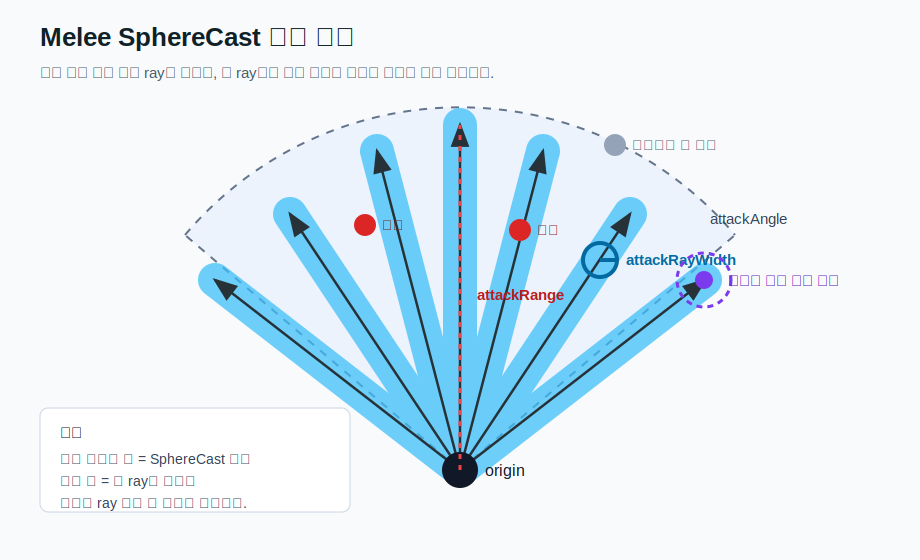

# Greatsword Range And Ray Width

이 문서는 대검 공격 범위 증가와 `attackRayWidth`, `attackRayWidthCharExtra`가 실제 판정에 어떤 영향을 주는지 정리한 내용입니다.

## 대상

현재 모드에서 "대검"으로 보는 조건은 다음과 같습니다.

```text
weapon.m_shared.m_skillType == Swords
weapon.m_shared.m_itemType == TwoHandedWeapon
```

즉 검 스킬을 쓰는 양손 무기만 대검 범위 증가 로직의 대상입니다.

## 바닐라 melee 판정 구조

발헤임의 일반 melee 공격은 부채꼴 전체를 한 번에 채우는 방식이 아닙니다.

대략 다음 흐름으로 판정합니다.

```text
1. attackAngle 범위 안에서 여러 방향 ray를 만든다.
2. 각 ray는 약 4도 간격으로 생성된다.
3. 각 ray 방향으로 attackRange만큼 SphereCast를 쏜다.
4. SphereCast의 기본 반경은 attackRayWidth다.
5. 캐릭터 전용으로 attackRayWidth + attackRayWidthCharExtra 반경의 SphereCast를 추가로 쏜다.
```

간단히 보면 "부채꼴 면"이라기보다 "부채꼴 안에 여러 개의 두꺼운 선을 쏘는 방식"입니다.



## 주요 필드

### attackRange

공격이 앞으로 얼마나 멀리 뻗는지를 정합니다.

단, `attackRange`만 늘린다고 해서 반지름이 큰 부채꼴 전체가 맞는 것은 아닙니다. 각 ray가 더 멀리 뻗을 뿐이고, ray 사이의 빈 공간은 거리와 함께 커집니다.

예를 들어 ray 간격이 4도라면:

```text
거리 3m에서 ray 사이 간격  ~= 0.21m
거리 10m에서 ray 사이 간격 ~= 0.70m
```

그래서 `attackRange`만 크게 늘리면 멀리 있는 적은 부채꼴 안에 있어도 ray 사이 빈 공간에 들어가 안 맞을 수 있습니다.

### attackRayWidth

기본 SphereCast 반경입니다.

지형, 오브젝트, 캐릭터 기본 판정에 사용됩니다.

바닐라 구조는 대략 다음과 같습니다.

```csharp
SphereCast(
    origin,
    attackRayWidth,
    direction,
    attackRange - attackRayWidth
);
```

즉 `attackRayWidth`를 키우면 판정은 두꺼워지지만, 동시에 실제로 앞으로 쓸고 나가는 거리는 줄어듭니다.

### attackRayWidthCharExtra

캐릭터 전용 추가 반경입니다.

캐릭터 판정은 다음처럼 계산됩니다.

```text
characterRadius = attackRayWidth + attackRayWidthCharExtra
```

그리고 대략 다음과 같이 추가 SphereCast를 합니다.

```csharp
SphereCast(
    origin + heightOffset,
    attackRayWidth + attackRayWidthCharExtra,
    direction,
    attackRange - (attackRayWidth + attackRayWidthCharExtra)
);
```

이 값은 캐릭터를 더 잘 맞추기 위한 보정이지만, 너무 커지면 오히려 캐릭터 판정이 앞으로 나가지 못할 수 있습니다.

## 현재 모드의 대검 보정

현재 구현은 공격이 실제로 `DoMeleeAttack()`을 수행하는 동안만 다음 값을 임시로 키웁니다.

```csharp
attack.m_attackRange *= rangeScale;
attack.m_attackRayWidth *= rayWidthScale;
attack.m_attackRayWidthCharExtra *= rayWidthScale;
```

공격이 끝나면 원래 값으로 복구합니다.

시각 효과도 함께 보정합니다. 공격 시작 시 무기에 붙은 `MeleeWeaponTrail`의 `_base`에서 `_tip`까지의 거리를 `rangeScale`만큼 늘려서, 검기/궤적이 실제 사거리 증가와 비슷하게 길어 보이게 합니다.

## 스케일 공식

기본 공식은 검 스킬 레벨을 기준으로 선형 증가합니다.

```text
skillFactor = SwordsLevel / 100

rangeScale   = lerp(1, Great Sword Skill Scaling Max Multiplier, skillFactor)
rayWidthScale = lerp(1, Great Sword Skill Scaling Ray Width Max Multiplier, skillFactor)
```

기본 max 값이 둘 다 `2.0`이면:

```text
Swords 0   => 1.00x
Swords 25  => 1.25x
Swords 50  => 1.50x
Swords 75  => 1.75x
Swords 100 => 2.00x
```

## 예시

원본 값:

```text
attackRange = 3.0
attackRayWidth = 0.3
attackRayWidthCharExtra = 0.3
```

검 스킬 100, range max 2.0, rayWidth max 2.0이면:

```text
attackRange = 6.0
attackRayWidth = 0.6
attackRayWidthCharExtra = 0.6

characterRadius = 0.6 + 0.6 = 1.2
character sweep distance = 6.0 - 1.2 = 4.8
```

이 정도는 사거리도 늘고, 캐릭터 판정 두께도 늘어나서 자연스럽습니다.

## rayWidth multiplier가 너무 클 때의 문제

`rayWidthScale`을 지나치게 키우면 오히려 캐릭터가 안 맞는 느낌이 날 수 있습니다.

예를 들어 같은 원본 값에서 range max 2.0, rayWidth max 10.0이면:

```text
attackRange = 6.0
attackRayWidth = 3.0
attackRayWidthCharExtra = 3.0

기본 판정:
radius = 3.0
sweep distance = 6.0 - 3.0 = 3.0

캐릭터 판정:
characterRadius = 3.0 + 3.0 = 6.0
character sweep distance = 6.0 - 6.0 = 0.0
```

이 경우 지형이나 오브젝트는 기본 판정으로 아직 앞으로 3m 정도 쓸고 나가지만, 캐릭터 전용 판정은 거의 앞으로 이동하지 않습니다.

그래서 "땅이나 지형지물은 잘 맞는데 캐릭터는 안 맞는" 현상이 생길 수 있습니다.

또한 Unity `SphereCast`는 시작 시점에 이미 구체 안에 겹쳐 있는 collider를 안정적으로 잡는 용도가 아닙니다. 반경이 너무 커지면 적이 시작 구체 안에 들어가 오히려 판정이 불안정해질 수 있습니다.

## 왜 attackRange만 늘리면 멀리 있는 적이 안 맞는가

`attackRange`만 크게 늘리면 각 ray는 길어지지만, ray 사이의 각도 간격은 그대로입니다.

즉 멀리 갈수록 ray 사이 빈 공간이 커집니다.

```text
range 증가 => ray 길이 증가
rayWidth 그대로 => ray 사이 빈 공간 증가
결과 => 먼 거리의 부채꼴 내부에 있어도 안 맞는 적이 생김
```

그래서 대검 범위 증가는 `attackRange`만 키우기보다 `attackRayWidth`와 `attackRayWidthCharExtra`도 함께 키우는 것이 필요합니다.

## 권장 방향

`rayWidthScale`은 너무 크게 주면 역효과가 납니다.

현재 바닐라 SphereCast 구조를 유지한다면 보통 다음 범위가 더 안정적입니다.

```text
range multiplier: 2.0 ~ 4.0
rayWidth multiplier: 1.5 ~ 3.0
```

특히 다음 조건을 넘기면 위험합니다.

```text
attackRayWidth + attackRayWidthCharExtra >= attackRange
```

이 상태가 되면 캐릭터 전용 SphereCast의 전진 거리가 0에 가까워져서, 캐릭터가 오히려 덜 맞을 수 있습니다.

## 더 근본적인 대안

현재 방식은 바닐라 melee 판정을 유지하면서 값을 키우는 보정입니다.

정말로 "반지름 N짜리 부채꼴 또는 원호 전체 안의 적을 모두 맞힘"을 원한다면, 바닐라 SphereCast를 키우는 대신 별도의 커스텀 판정을 만들어야 합니다.

예시:

```text
1. OverlapSphere로 주변 캐릭터 후보를 찾는다.
2. 플레이어 정면 기준 각도 필터를 적용한다.
3. 거리 필터를 적용한다.
4. 벽/지형 차단 여부를 확인한다.
5. 통과한 대상에게 HitData를 적용한다.
```

이 방식은 더 일관된 부채꼴/원호 범위를 만들 수 있지만, 바닐라 melee 판정보다 구현이 복잡하고 밸런스가 달라질 수 있습니다.
